# Database Schema

## Entity Relationship Diagram (ERD)

```mermaid
erDiagram
    USERS ||--o{ POSTS : creates
    USERS {
        uuid id PK
        string email
        string display_name
    }
```

## Row Level Security (RLS)
- Ensure all tables have RLS enabled.
- Default to restricting all access, and selectively add policies for `SELECT`, `INSERT`, `UPDATE`, and `DELETE`.
