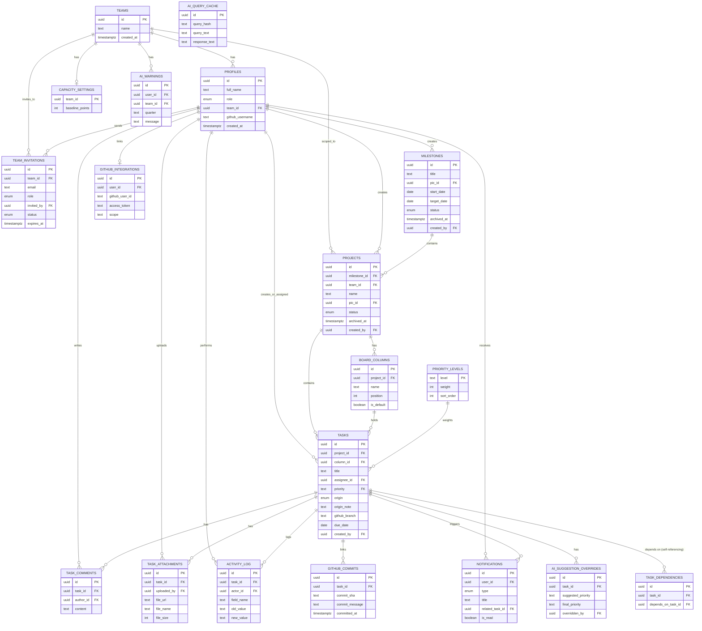
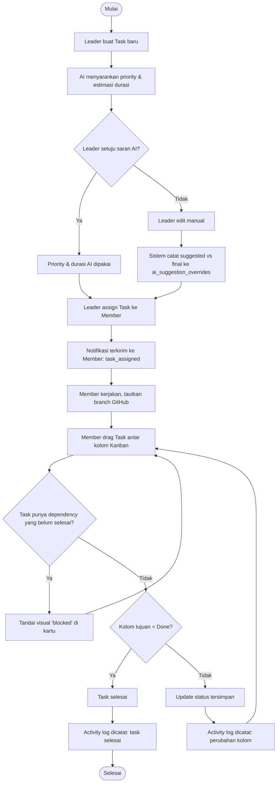
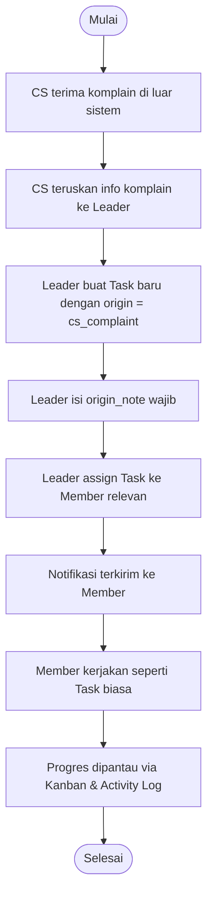
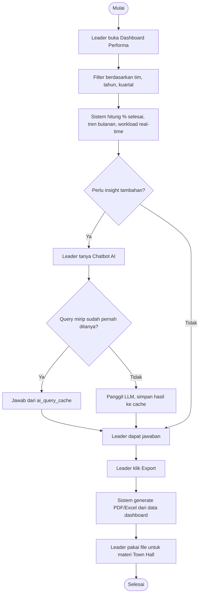
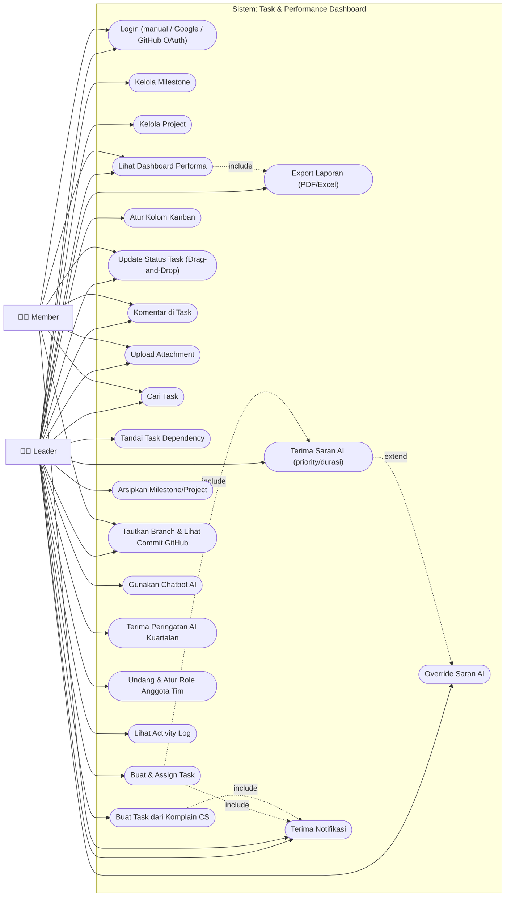

# Diagram — Task & Performance Dashboard

Berisi: **ERD**, **Activity Diagram** (3 alur utama), dan **Use Case Diagram**.
Diagram ditulis dalam sintaks Mermaid — render otomatis di editor/viewer yang mendukung Mermaid (GitHub, Notion, VS Code + extension, dll).

---

## 1. Entity Relationship Diagram (ERD)

---

## 2. Activity Diagram

### 2.1 Alur Task Normal (dibuat → selesai)

### 2.2 Alur Task dari Komplain Customer Service

### 2.3 Alur Leader Menyiapkan Laporan Town Hall

---

## 3. Use Case Diagram

**Catatan akses Member ke Chatbot AI (UC16) dan Peringatan Kuartalan (UC19) belum dimasukkan** — masih open question di PRD §19 (poin 2).
